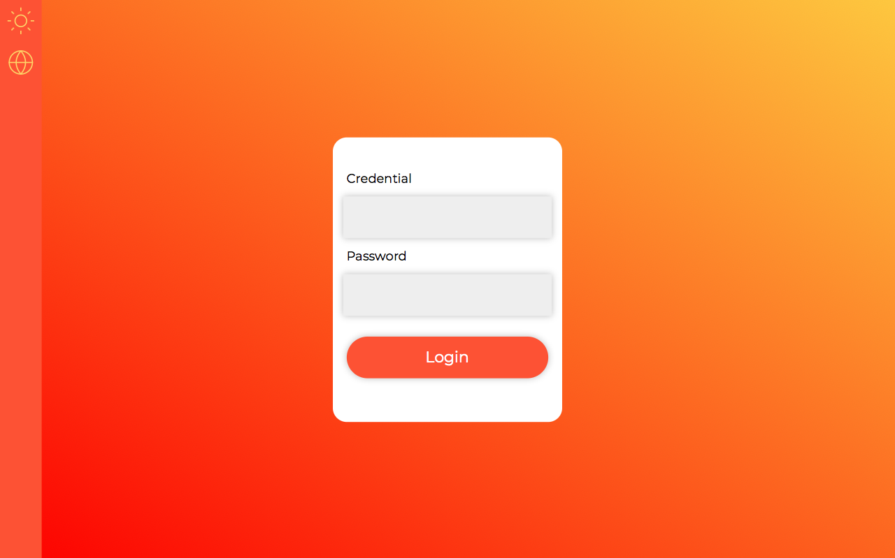
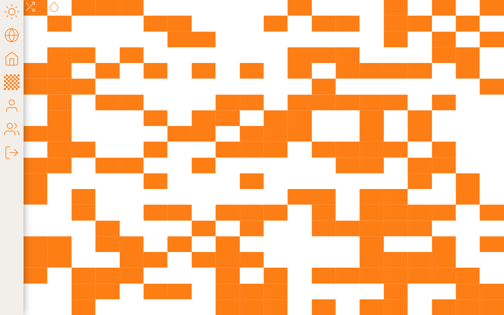

## Checkerboard

This application is a simple checkerboard in which each tile can be toggled to create all sorts of patterns and it saves up until 5 patterns per user.

## Installation

To run this application you have to clone it locally. To clone it just copy the command below in your terminal:

```
git clone https://github.com/dalagnol/checkerboard.git
```

After cloning it, using the package manager Yarn, type the following command to run it:

```
yarn && yarn start
```

## Usage

After your yarned it, you must see a login page.



To login use the following data:

```
{
    name: "root",
    email: "root@icloud.com",
    password: "123test"
}
```

After logging in, you will be redirected to the landing page.


To access your checkerboards, just click on the checker icon on the sidebar.



Use your creativity to create multiple drawing and enjoy yourself!
